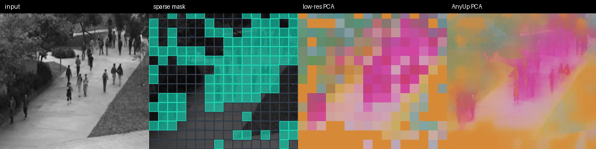

# burn_jepa 🔥🔮

[](https://github.com/mosure/burn_jepa/actions?query=workflow%3Atest)
[](https://github.com/mosure/burn_jepa/actions?query=workflow%3A%22deploy+github+pages%22)
[](https://crates.io/crates/burn_jepa)
[](https://docs.rs/burn_jepa)
[](./docs/papers/vjepa21_ttt_sparse_temporal_preprint.pdf)

burn-native sparse V-JEPA 2.1 inference and training, with sparse patchify,
interframe token memory, SC-TTT temporal adapters, AnyUp/PCA visualization, and
native/wasm Bevy demos.



frame 3 from the e2e sparse gallery, generated with the local f16 V-JEPA 2.1
base package and f16 AnyUp package: input, patch-diff sparse mask, low-res
token-cache PCA, and high-res AnyUp PCA.

## features

### high-level

- Loads V-JEPA 2.1 Burn packages and upstream-style `safetensors` checkpoints.
- Runs base V-JEPA 2.1 or trained SC-TTT V-JEPA 2.1 encoders.
- Supports dense, patch-diff sparse, AutoGaze sparse, and precomputed mask
  inputs.
- Skips masked pixels with flex-gmm sparse patchify on WGPU/CUDA lanes.
- Keeps a persistent full-frame token feature cache with sparse device updates.
- Projects low-res token features and high-res AnyUp features through rolling
  PCA for live visualization.
- Ships training configs, smoke tests, benchmarks, a paper artifact, and a
  native/wasm `bevy_jepa` viewer.

### cargo features

| feature | default | target | notes |
|---|---:|---|---|
| `ndarray` | yes | native | CPU reference backend |
| `webgpu` | yes | native/web | Burn WebGPU backend |
| `wgpu` | no | native/web | Burn WGPU backend without selecting the WebGPU compiler feature |
| `cuda` | no | native | CUDA backend |
| `flex` | no | native/web | Burn dispatch/flex experiments |
| `dispatch` | no | native/web | Burn dispatch backend experiments |
| `wasm` | no | wasm32 | wasm-bindgen API over Burn WebGPU |
| `wasm-fusion` | no | wasm32 | experimental Burn fusion path; browser WebGPU validation still prefers the default raw WebGPU build |
| `sparse-patchify-wgpu` | no | native/web | flex-gmm sparse patchify + sparse feature memory on WGPU; enabled by default in `bevy_jepa` |
| `sparse-patchify-cuda` | no | native | flex-gmm sparse patchify + sparse feature memory on CUDA |
| `autogaze-*` | no | native/web | optional `burn_autogaze` mask projection adapters |

## burn support

| burn_jepa | burn | burn-store | status |
|---|---:|---:|---|
| `0.21.x` | `0.21.x` | `0.21.x` | current |
| `<0.21` | `<0.21` | `<0.21` | not supported in this repo |

## quick start

```rust,no_run
use burn::backend::NdArray;
use burn_jepa::{
    make_context_target_masks, VJepaConfig, VJepaPipeline, VJepaVideoShape,
};

type B = NdArray<f32>;

let device = Default::default();
let config = VJepaConfig::tiny_for_tests();
let pipeline = VJepaPipeline::<B>::random(config.clone(), &device);

let shape = VJepaVideoShape::new(1, 3, 4, 32, 32);
let video = VJepaPipeline::<B>::tensor_from_frames(
    &vec![0.0; shape.num_values()],
    shape,
    &device,
)?;

let (context, target) = make_context_target_masks(config.token_grid(), 0.5);
let output = pipeline
    .model()
    .predict_dense_targets(video, &context, &target)?;

assert_eq!(output.predictions.shape().dims::<3>(), [1, target.len(), 32]);
# Ok::<(), anyhow::Error>(())
```

## bevy viewer

```sh
cargo run -p bevy_jepa
cargo run -p bevy_jepa -- --source camera --image-size 256
cargo run -p bevy_jepa -- --source camera --image-size 1024
cargo run -p bevy_jepa -- --encoder-source base-checkpoint --sparse-encode-mode dense
cargo run -p bevy_jepa -- --encoder-source trained-ttt --mask-source patch-diff
```

install the viewer from git main with the package name as the positional crate
argument. Some Cargo versions do not support `cargo install --package`:

```sh
cargo install --git https://github.com/mosure/burn_jepa.git --branch main bevy_jepa --locked --force
```

the no-arg native default starts the live sparse feature pipeline with camera
input, patch-diff sparse masks, low-res token-cache PCA every processed frame,
and high-res AnyUp/PCA decoupled from the low-res worker. Controls live in the
in-app menu, including base vs. TTT, dense vs. sparse, patch-diff threshold,
refresh policy, 256/512/1024 resolution, and AnyUp mode.

See [crates/bevy_jepa/README.md](./crates/bevy_jepa/README.md) for native,
wasm, camera, CDN model-package, and Pages notes.

## training

```sh
cargo run --bin burn-jepa -- print-config > train.toml
cargo run --bin burn-jepa -- train-ttt --config train.toml
cargo run --bin burn-jepa -- eval-ttt --config train.toml --model ttt-model.mpk --no-full-grid
```

SC-TTT training distills a sparse per-frame student toward the V-JEPA 2.1 3D
teacher while carrying bounded fast-memory state through video windows. Current
production configs and stability notes live in `configs/production/` and
`docs/production-ttt-status.md`.

## docs

- [preprint pdf](./docs/papers/vjepa21_ttt_sparse_temporal_preprint.pdf) and
  [source](./docs/papers/vjepa21_ttt_sparse_temporal_preprint.tex)
- [high-res AnyUp/PCA pipeline](./docs/highres-anyup-pca-pipeline.md)
- [interframe feature memory](./docs/interframe-feature-memory.md)
- [TTT training notes](./docs/ttt-training.md)
- [production runbook](./docs/production-training-runbook.md)
- [benchmark results](./docs/e2e-benchmark-results.md)

## validation

```sh
cargo test
cargo check -p bevy_jepa --target wasm32-unknown-unknown --features bevy-web-demo
cargo test -p burn_jepa --no-default-features --features ndarray,wgpu,sparse-patchify-wgpu highres
```

hardware-specific CUDA/WGPU benches, long-rollout checks, and browser deploy
gates are documented in the linked docs.
